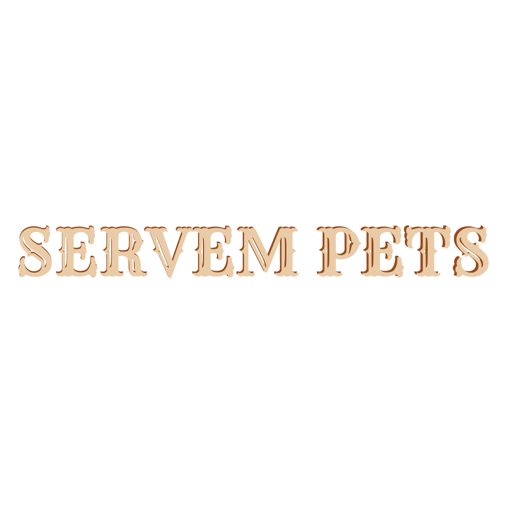

  

<h3>Olá! Bem vindo ao Servem Pets!</h3>

O Servem Pets é uma plataforma revolucionária que simplifica a busca por cuidadores confiáveis para animais de estimação. Como a produção de trabalhos acadêmicos pode ser um momento sensível na vida dos estudantes, o Servem Pets busca aliviar os tutores de pets das preocupações relacionadas à segurança e bem-estar de seus companheiros peludos durante os períodos de ausência. Nosso objetivo é proporcionar uma experiência tranquila e transparente, permitindo que os usuários se concentrem no que realmente importa: amor e a felicidade de seus animais de estimação. Com o Servem Pets, encontrar o cuidador ideal para seu pet nunca foi tão fácil e confiável.

Nosso site é o seu centro de informações para esclarecer dúvidas, informar o que é o Servem Pets, orientar sobre o uso do aplicativo e, o melhor de tudo, sem a necessidade de registro!

<h4>Descubra por que o Servem Pets se destaca como a escolha preferida dos tutores de animais de estimação:</h4>

* Interface intuitiva: Nossa plataforma oferece uma experiência de usuário intuitiva e amigável, facilitando a busca por cuidadores confiáveis para seus pets.
* Ampliação da rede de cuidadores: Conectamos os tutores a uma ampla rede de cuidadores qualificados e dedicados, garantindo que seus pets recebam o melhor cuidado possível.
* Compromisso com o bem-estar animal: Nosso objetivo é promover o bem-estar e a felicidade dos animais de estimação, garantindo que cada pet seja cuidado com amor e dedicação.

<h4>Deseja entrar em contato?</h4>

O meio de comunicação oficial do Servem Pets são:
Instagram: [Servem Pets](https://www.instagram.com/servem_pets/).
Twitter: [Servem Pets](https://twitter.com/servem_pets).

  

##

<h3>Hello! Welcome to Servem Pets!</h3>

Servem Pets is a revolutionary platform that simplifies the search for trustworthy pet caregivers. As producing academic work can be a sensitive time in students' lives, Servem Pets seeks to alleviate pet owners' concerns regarding the safety and well-being of their furry companions during periods of absence. Our goal is to provide a smooth and transparent experience, allowing users to focus on what really matters: the love and happiness of their pets. With Servem Pets, finding the perfect caregiver for your pet has never been easier and more reliable.

Our website is your go-to hub for clearing doubts, shedding light on what Servem Pets is all about, guiding you through app usage, and best of all, no registration required!

<h4>Discover why Servem Pets stands out as the preferred choice for pet owners:</h4>

* Intuitive interface: Our platform offers an intuitive and user-friendly experience, making it easy to find trustworthy caregivers for your pets.
* Expanded network of caregivers: We connect pet owners with a wide network of qualified and dedicated caregivers, ensuring that your pets receive the best possible care.
* Commitment to animal welfare: Our goal is to promote the well-being and happiness of pets, ensuring that each pet is cared for with love and dedication.

<h4>Want to get in touch?</h4>

The official communication channel for Servem Pets are:
Instagram: [Servem Pets](https://www.instagram.com/servem_pets/).
Twitter: [Servem Pets](https://twitter.com/servem_pets).

  

